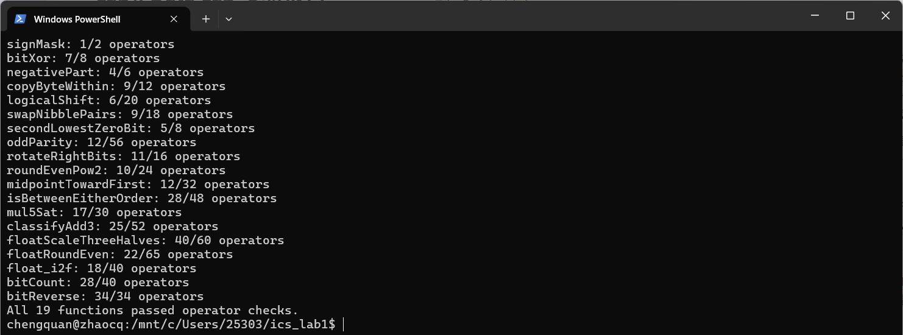
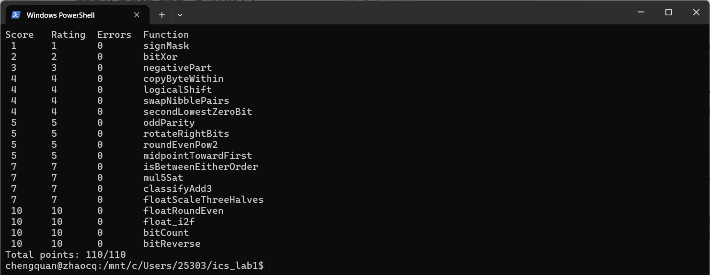

# Lab1: Data Lab 实验报告

- 姓名：赵成全
- 学号：25303050024
- 仓库：https://github.com/Chengquan-Zhao/ics_lab1

## 1. 测试结果

### 1.1 运算符与操作数检查

19 个函数全部通过运算符检查（`All 19 functions passed operator checks.`）。

### 1.2 正确性测试

所有函数 Errors 均为 0，最终得分 `Total points: 110/110`。

## 2. 各函数实现思路

### P1 signMask

常量只能用 0–255，把 1 左移 31 位即可得到 `0x80000000`：`1 << 31`。

### P2 bitXor

异或等价于"两位不全为 1 且不全为 0"。由德摩根律：`x ^ y = ~(x & y) & ~(~x & ~y)`，只用到 `~` 和 `&`。

### P3 negativePart

`x >> 31` 在 x 为负时为全 1、否则为全 0，作为掩码；补码下 `-x = ~x + 1`。结果为 `(~x + 1) & (x >> 31)`。

### P4 copyByteWithin

字节号乘 8（`<< 3`）得到位偏移。先用 `(x >> s) & 0xFF` 取出源字节，再用 `x & ~(0xFF << d)` 把目标字节清零，最后把源字节左移到目标位置后按位或回去。

### P5 logicalShift

算术右移会在高 n 位补符号位，需要构造掩码清除。`(1 << 31) >> n` 得到高 n+1 位为 1 的数，左移 1 位后恰为高 n 位为 1，取反即为掩码。结果为 `(x >> n) & mask`。n = 0 时掩码为全 1，也不会出现移 32 位的未定义行为。

### P6 swapNibblePairs

由 `0x0F` 拼出掩码 `m = 0x0F0F0F0F`。低半字节左移 4 位 `(x & m) << 4`，高半字节右移 4 位 `(x >> 4) & m`（掩码同时清除算术右移带入的符号位），两者按位或。

### P7 secondLowestZeroBit

利用两个经典技巧：`x | (x + 1)` 把最低的 0 位置 1；`~y & (y + 1)` 提取 y 的最低 0 位。先令 `y = x | (x + 1)` 填掉最低 0，此时 y 的最低 0 就是 x 的第二低 0，再用第二个技巧取出。若不存在第二个 0，则 y 为 -1，结果自然为 0。

### P8 oddParity

折半异或：依次执行 `x ^= x >> 16, 8, 4, 2, 1`，每次都把高半部分异或到低半部分，最低位最终等于所有位的异或（1 的个数为奇数时为 1）。题目要求偶数个 1 时返回 1，故返回 `!(x & 1)`。

### P9 rotateRightBits

先 `n &= 31` 实现模 32。右半部分用 P5 的方法做逻辑右移；左半部分本应为 `x << (32 - n)`，但 n = 0 时移位 32 位未定义，因此拆成 `(x << 1) << (31 - n)`；又因为 0 ≤ n ≤ 31 时 `31 - n == n ^ 31`，可避免减法。两部分按位或。

### P10 roundEvenPow2

加偏置后截断：`half = 2^(n-1)`，`lsb = (x >> n) & 1`（商的最低位），计算 `r = x + half - 1 + lsb`，再 `(r >> n) << n` 清掉低 n 位。余数大于 half 必进位，小于 half 不进位，等于 half 时只有商为奇数（lsb = 1）才进位，实现向偶舍入。`-1` 用 `+ ~0` 表示；x ≤ 0x3fffffff 保证不溢出。

### P11 midpointTowardFirst

利用 `x + y = 2(x & y) + (x ^ y)` 得到不溢出的下取整平均 `m = (x & y) + ((x ^ y) >> 1)`。当 x+y 为奇数（`(x ^ y) & 1`）时，真实中点是 m + 0.5：若 x > y 则应取 m + 1。此时 x > y 等价于 x > m，即 `m - x < 0`；由于 m 位于 x、y 之间，`m - x` 的真实值在 int 范围内，用 `(m + ~x + 1) >> 31` 取符号即可。

### P12 isBetweenEitherOrder

关键是实现不受溢出影响的 `p ≤ q`：`p + ~q` 即 `p - q - 1`，其真实值为负 ⇔ p ≤ q。两加数同号时真实和的符号等于二者的公共符号，异号时不会溢出、直接看和的符号，故"真实和为负"的符号位为 `(p & ~q) | ((p ^ ~q) & (p + ~q))`。据此求出 x≤a、x≤b、a≤x、b≤x，答案为 `(a≤x & x≤b) | (b≤x & x≤a)` 的符号位。

### P13 mul5Sat

`5x = (x << 2) + x`。若 `x << 1`、`x << 2`、`sum` 中任何一个的符号与 x 不同，则发生溢出：前两者检测乘 4 的溢出，最后一个检测加法溢出。把三者与 x 异或后按位或，右移 31 位得到全 1 或全 0 的掩码 ovf。饱和值为 `(x >> 31) ^ ~(1 << 31)`（x ≥ 0 时为 INT_MAX，x < 0 时为 INT_MIN），最后用掩码在饱和值与 sum 之间选择。

### P14 classifyAdd3

分两次加法 `s1 = x + y`、`s2 = s1 + z`，分别记录每次的溢出方向：正溢出 `(~a & ~b & s) >> 31`（两个非负数得负），负溢出 `(a & b & ~s) >> 31`（两个负数得非负），结果为 0 或 -1。真实和 = s2 + 2³² × (正溢出次数 − 负溢出次数)，而对三个 int 相加，该差值只可能为 -1、0、1，恰好就是所求答案，计算为 `n1 + n2 - (p1 + p2)`。"先正溢出再负溢出"互相抵消的情况也被正确处理。

### P15 floatScaleThreeHalves

- exp = 255（NaN 或 ∞）：直接返回 uf（∞ × 1.5 仍为 ∞）。
- 非规格化数：值为 frac × 2⁻¹⁴⁹，令 m = 3·frac，结果为 m / 2 并向偶舍入（m 为奇数时恰为一半，仅当 m>>1 为奇数时加 1）。若结果 ≥ 2²³，其位模式恰好就是最小规格化数的编码，因此直接返回 `sign | q`。
- 规格化数：M 为带隐含 1 的 24 位尾数，m = 3M ∈ [3·2²³, 3·2²⁴)，需右移 s 位（m < 2²⁵ 时 s = 1，否则 s = 2）回到 24 位，并对丢弃的低 s 位向偶舍入；新指数为 exp + s − 1。若舍入后尾数进位到 2²⁴，再右移 1 位、指数加 1；指数 ≥ 255 时返回 ±∞。

### P16 floatRoundEven

设真实指数 E = exp − 127：

- E ≥ 23：已是整数（NaN、∞ 的 E = 128 也在此列），返回 uf。
- E < −1：|x| < 0.5，返回带符号的 0。
- E = −1：|x| ∈ [0.5, 1)，恰好为 0.5 时舍入到偶数 0，否则为 ±1.0（`0x3F800000`）。
- 0 ≤ E ≤ 22：小数部分位于 frac 的低 d = 23 − E 位。直接在位模式上做与 P10 相同的向偶舍入：加 `2^(d-1) - 1 + 保留部分最低位`，再清除低 d 位。尾数进位溢出时会自然进位到指数，结果仍正确（浮点编码对非负数单调）。

### P17 float_i2f

x = 0 时返回 0。取出符号位，把绝对值放入 unsigned（`u = -u` 对 INT_MIN 同样正确）。循环左移 u 直到最高位为 1，同时递减指数。此时 `u >> 8` 为 24 位尾数，低 8 位为舍弃部分，与 0x80 比较进行向偶舍入。指数初值取 157（比真实偏置指数少 1），用 `(E << 23) + q` 拼接：q 的隐含 1 恰好给指数补上 1，若舍入进位到 2²⁴ 也会自动再给指数加 1。

### P18 bitCount

分治计数：用掩码 `0x55555555`、`0x33333333`、`0x0F0F0F0F`（均由 ≤ 0xFF 的常量拼接而成）依次得到每 2 位、4 位、8 位内 1 的个数；再用 `x + (x >> 8)`、`x + (x >> 16)` 把 4 个字节的计数累加，结果最多为 32，最后 `& 0x3F` 取出。

### P19 bitReverse

分治交换：依次交换相邻的 16 位、8 位、4 位、2 位、1 位块，五轮后每一位都到达镜像位置。运算符上限较紧，因此掩码逐级推导，每个只花 2 个运算符：`m8 = 0x00FF00FF`，`m4 = m8 ^ (m8 << 4) = 0x0F0F0F0F`，`m2 = m4 ^ (m4 << 2) = 0x33333333`，`m1 = m2 ^ (m2 << 1) = 0x55555555`。右移后先与掩码按位与，以清除算术右移带入的 1。

## 3. 参考资料

- 课程实验说明：https://ics-26fall-fdu.github.io/labs/lab1-data-lab/
- 实验过程中使用 Claude（AI 助手）讲解思路、辅助调试
- B 站视频：https://www.bilibili.com/video/BV1gGhB6qErA/?share_source=copy_web&vd_source=18cfe3b736f945583fd148ff3e86d799
